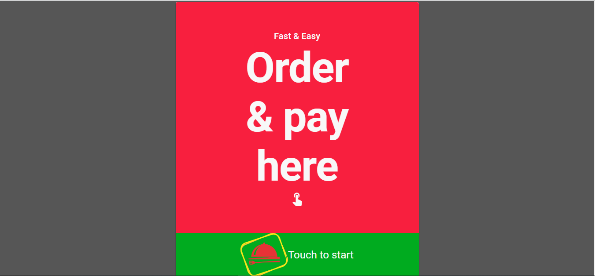
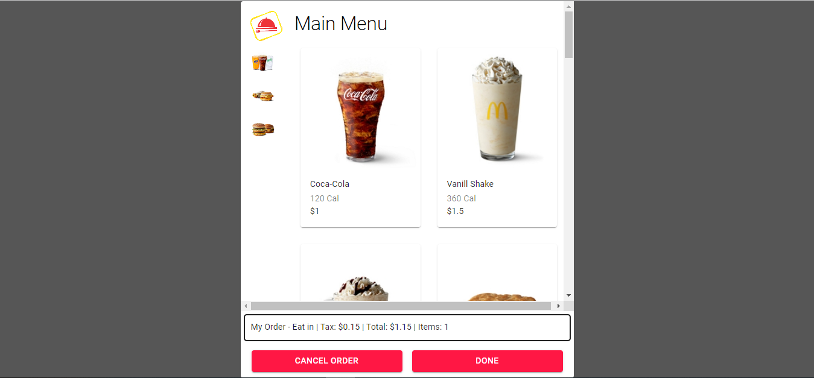
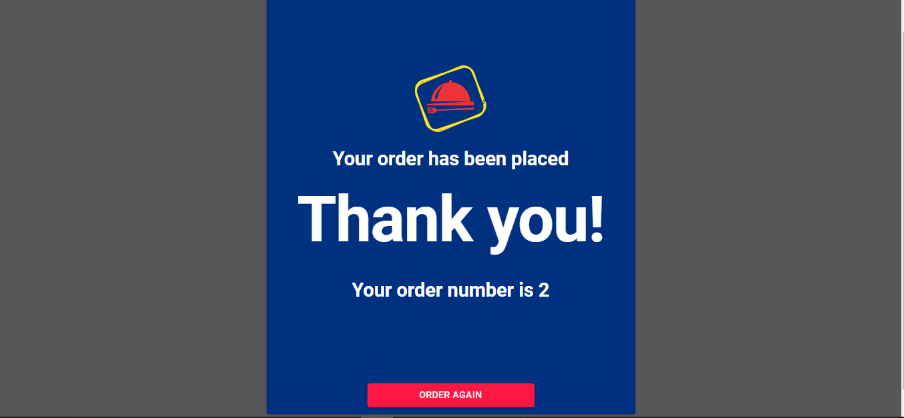

# Self-Order-System-React-Nodejs

 

 

 

 

 

 

# How to Start the Project
# Install the dependency
yarn install

# Make a build of client side
yarn run build

# Generate Dummy products
http://localhost:5000/api/products/seed

# run the server n client on same port
yarn run server
